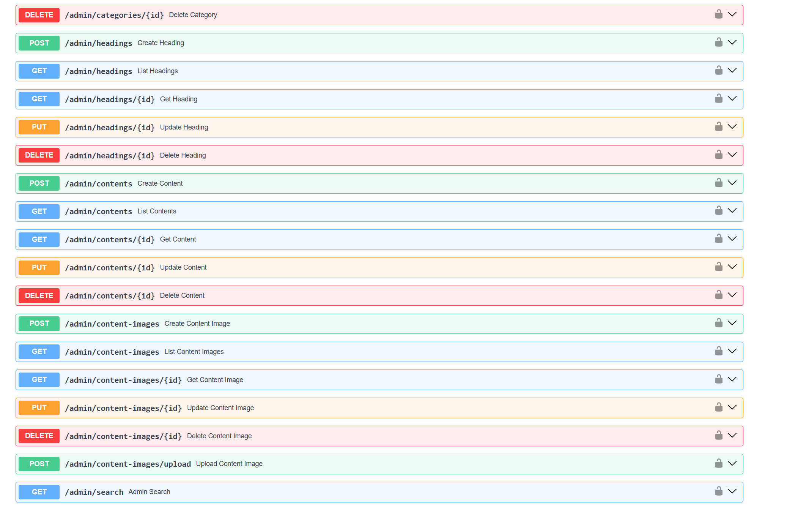
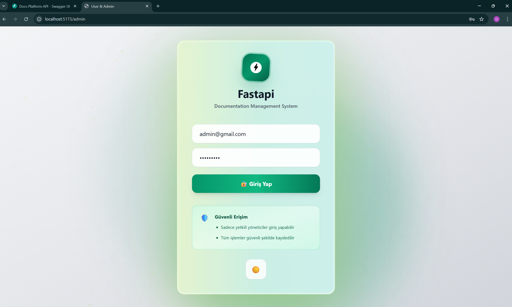
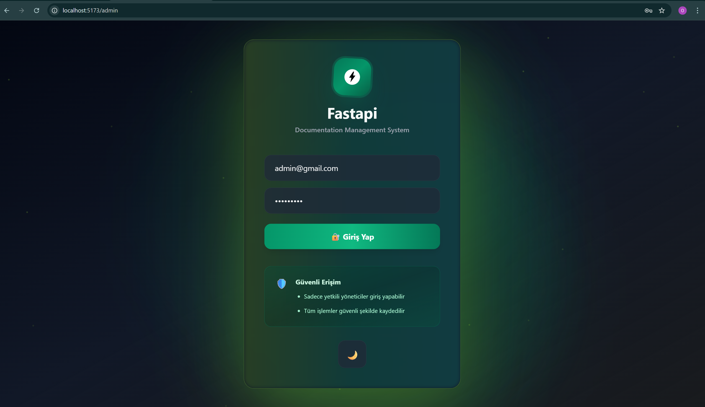
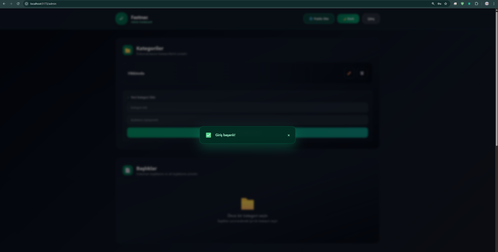
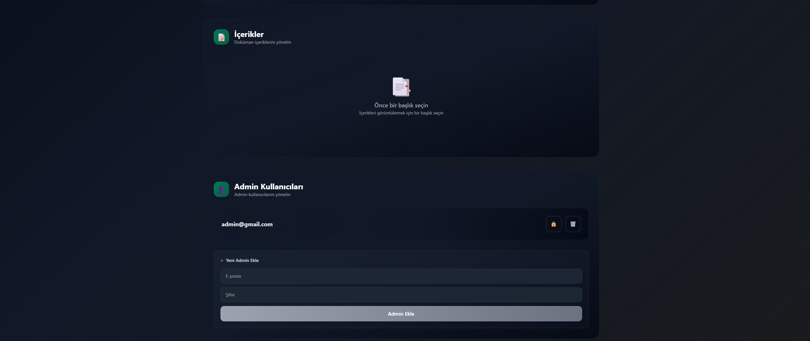
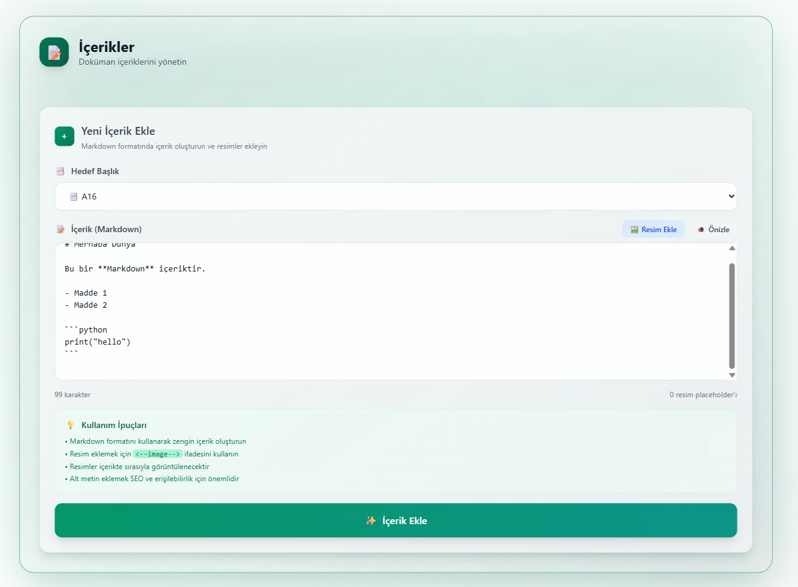

# 📚 Docs Platform API & Admin Panel

Bu proje, FastAPI tabanlı bir dokümantasyon yönetim sistemi ve React ile geliştirilmiş modern bir admin paneli içerir. Hem backend hem frontend Docker ve Postgres ile kolayca çalıştırılabilir.

---

## Proje Klasör Yapısı

```
backend/
  main.py
  requirements.txt
  DDL.sql
  uploads/
  app/
  venv/
frontend/
  src/
    admin/
    user/
    shared/
  index.html
  package.json
```

---

## Özellikler

- **Admin Panel:** Kategoriler, başlıklar, içerikler ve admin kullanıcıları yönetimi
- **Markdown Destekli İçerik:** Zengin metin ve resim ekleme
- **Güvenli Giriş:** Sadece yetkili adminler erişebilir
- **Swagger API:** Tüm endpointler için dokümantasyon
- **Docker ile Postgres:** Kolay veritabanı kurulumu

---

## Ekran Görüntüleri


### 1. Swagger API Dokümantasyonu



### 2. Docker Postgres Kurulumu


### 3. Admin Panel Giriş Ekranı
- Açık Tema:

- Koyu Tema:

- Hatalı Giriş:

- Başarılı Giriş:


### 4. Kategori Yönetimi


### 5. Başlık Yönetimi


### 6. İçerik Ekleme & Resim Yükleme
- Markdown ve resim ekleme:

- Resim yükleme ve önizleme:

- Dosya seçme:

- Başarılı içerik ekleme:


### 7. Kullanıcı Paneli & İçerik Görüntüleme


---

## Kurulum

1. **Backend için:**
   ```bash
   cd backend
   python -m venv venv
   .\venv\Scripts\activate
   pip install -r requirements.txt
   uvicorn main:app --reload
   ```
2. **Frontend için:**
   ```bash
   cd frontend
   npm install
   npm run dev
   ```
3. **Postgres için:**
   Docker Desktop ile `postgres` container başlatın.

---

## Kullanım
- Admin paneline erişmek için `/admin` adresini kullanın.
- API dokümantasyonu için `/docs` adresini ziyaret edin.
- İçerik eklerken Markdown ve resim yükleme desteği vardır.

---

## Katkı
Pull request ve issue açabilirsiniz.

---

## Lisans
MIT
